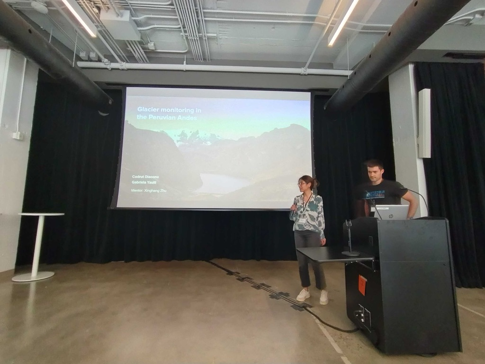
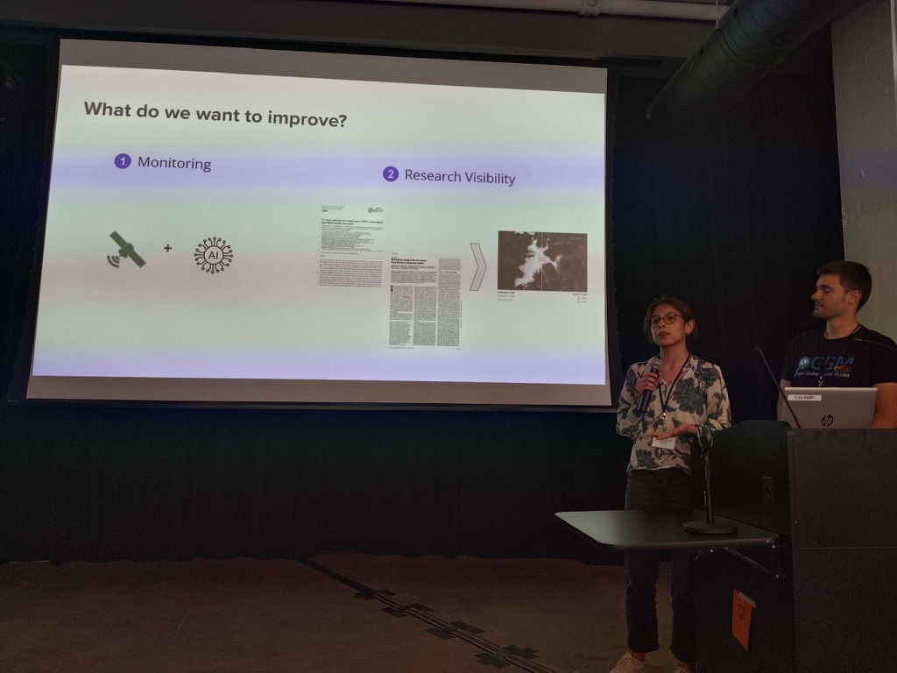

## Portfolio

---

### Mapping Poverty in Lima with Machine Learning and Satellite Imagery 

First I build co-occurence matrices of ingredients from Facebook posts from 2011 to 2015. Then, to identify interesting and rare ingredient combinations that occur more than by chance, I calculate Lift and PPMI metrics. Lastly, I plot time-series data of identified trends to validate my findings. Interesting food trends have emerged from this analysis.

 
#### Poster presented at the AI Latam SumMIT 2020, Boston MA

  

---

### Monitoring the Evolution of Glaciers surface in the Peruvian Andes

***Climate Change AI, Summer School 2024 @ Mila - Quebec AI Institute***
 

Over one week... First I build co-occurence matrices of ingredients from Facebook posts from 2011 to 2015. Then, to identify interesting and rare ingredient combinations that occur more than by chance, I calculate Lift and PPMI metrics. Lastly, I plot time-series data of identified trends to validate my findings. Interesting food trends have emerged from this analysis.

 

- [CCAI Summer School 2024 Recap](https://www.climatechange.ai/blog/2024-12-04-summer-school-24-in-person)
 

  

    
     
  

 
- We developed a visualization for...
 

 

---
### Data driven Approach for Road Safety in Nagpur, India

***FruitPunch AI, AI for Road Safety Challenge***
 

Over one week... First I build co-occurence matrices of ingredients from Facebook posts from 2011 to 2015. Then, to identify interesting and rare ingredient combinations that occur more than by chance, I calculate Lift and PPMI metrics. Lastly, I plot time-series data of identified trends to validate my findings. Interesting food trends have emerged from this analysis.

 

  

    
     
  

 
#### Final Presentation

 

- [FruitPunch AI Blog Post featuring our solution](https://www.fruitpunch.ai/blog/ai-and-visualisations-a-data-driven-all-rounded-approach-for-road-safety)
 
https://www.youtube.com/watch?v=FNRKcpUs7Rc

---

### Leveraging telcom data to Study tourists mobility patters in Andorra 
***Internship “Living Lab Andorra”***
 

First I build co-occurence matrices of ingredients from Facebook posts from 2011 to 2015. Then, to identify interesting and rare ingredient combinations that occur more than by chance, I calculate Lift and PPMI metrics. Lastly, I plot time-series data of identified trends to validate my findings. Interesting food trends have emerged from this analysis.

 

 "Mobility Patterns in Andorra captured over a full day.")

 

- Speaker at International Forum on “Smart Cities: Technologies and narratives to create sustainable cities”

 

    

---
